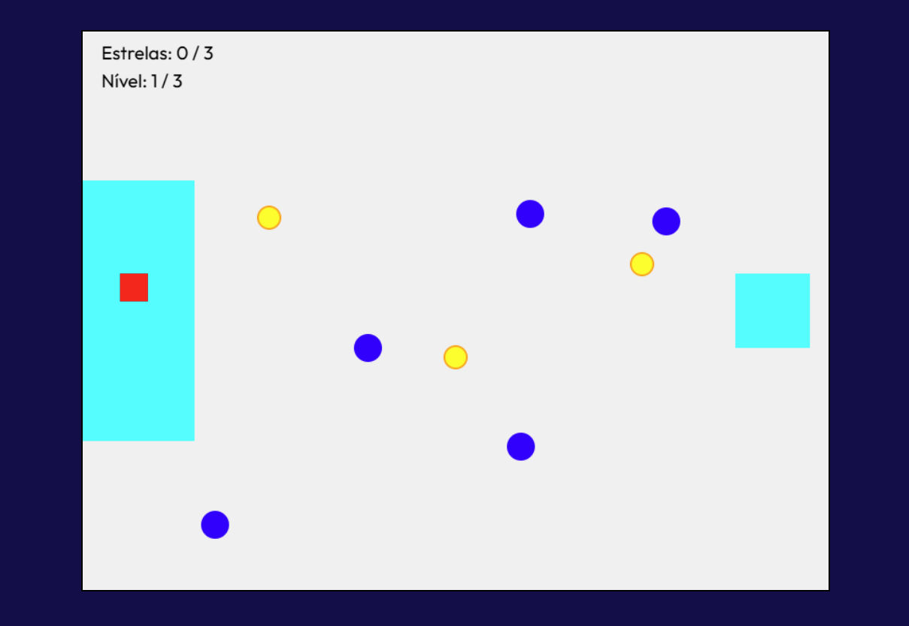

# The World's Hardest Game

## 👾 Descrição
"The World's Hardest Game" é um jogo desafiador onde o jogador deve navegar por uma série de níveis repletos de obstáculos. Colete todas as estrelas (pontos amarelos), e chegue ao final de cada nível sem colidir com os obstáculos em movimento.



## Estrutura do Projeto
O projeto é organizado da seguinte forma:

```
the-worlds-hardest-game
├── src
│   ├── index.html        # Estrutura principal do jogo
│   ├── style.css         # Estilos do jogo
│   ├── game.js           # Lógica do jogo
│   └── assets
│       └── levels.js     # Definição dos níveis do jogo
├── package.json          # Configuração do npm
└── README.md             # Documentação do projeto
```

## Como Executar o Jogo
1. Clone o repositório ou baixe os arquivos do projeto.
2. Navegue até o diretório do projeto.
3. Abra o arquivo `src/index.html` em um navegador da web.
4. Use as teclas de seta para mover o jogador e tente completar os níveis.

## Como testar o jogo em outra máquina

1. **Clone ou baixe este repositório**  
   Faça o download dos arquivos do projeto ou use o comando:
   ```
   git clone <URL_DO_REPOSITORIO>
   ```

2. **Instale o Node.js**  
   Certifique-se de que o [Node.js](https://nodejs.org/) está instalado na máquina.

3. **Instale as dependências**  
   No terminal, dentro da pasta do projeto, execute:
   ```
   npm install
   ```

4. **Inicie o servidor local**  
   Ainda no terminal, execute:
   ```
   npm start
   ```
   O navegador abrirá automaticamente o jogo.  
   Se não abrir, acesse manualmente: [http://localhost:8080](http://localhost:8080)

5. **Jogue e teste**  
   Use as setas do teclado para mover o jogador, desvie dos inimigos e tente chegar à meta dourada!

---

**Dica:**  
Se aparecer algum erro, verifique se todos os arquivos estão na pasta correta e se o Node.js está instalado.

## Contribuições
Contribuições são bem-vindas! Sinta-se à vontade para abrir issues ou pull requests para melhorias e correções.

## Licença
Este projeto é de código aberto e pode ser utilizado e modificado livremente.
